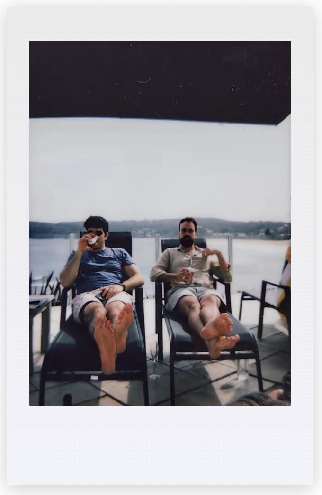

# 📷 instant-photo



📸 React component that makes images look like a polaroid.

## Usage

```bash
yarn add instant-photo
```
or

```bash
npm -i instant-photo
```

### Basic
```typescript jsx
<InstantPhoto
    image="https://images.unsplash.com/photo-1648142618804-92f908f93c10"
  />
```

### Size
'small' or 'large' (defaulting to large)

```typescript jsx
<InstantPhoto
    size="small"
    image="https://images.unsplash.com/photo-1648142618804-92f908f93c10"
  />
```

### Variants
'46mm' or '99mm' (defaulting to 46mm)

```typescript jsx
<InstantPhoto
    variant="99mm"
    image="https://images.unsplash.com/photo-1648142618804-92f908f93c10"
  />
```

### Filters
'polaroid' | 'vintage' | 'greyscale' | 'bloom' | 'none' (defaulting to polaroid)

```typescript jsx
<InstantPhoto
    filter="vintage"
    image="https://images.unsplash.com/photo-1648142618804-92f908f93c10"
  />
```

For more examples see `src/examples/examples.stories.tsx`
